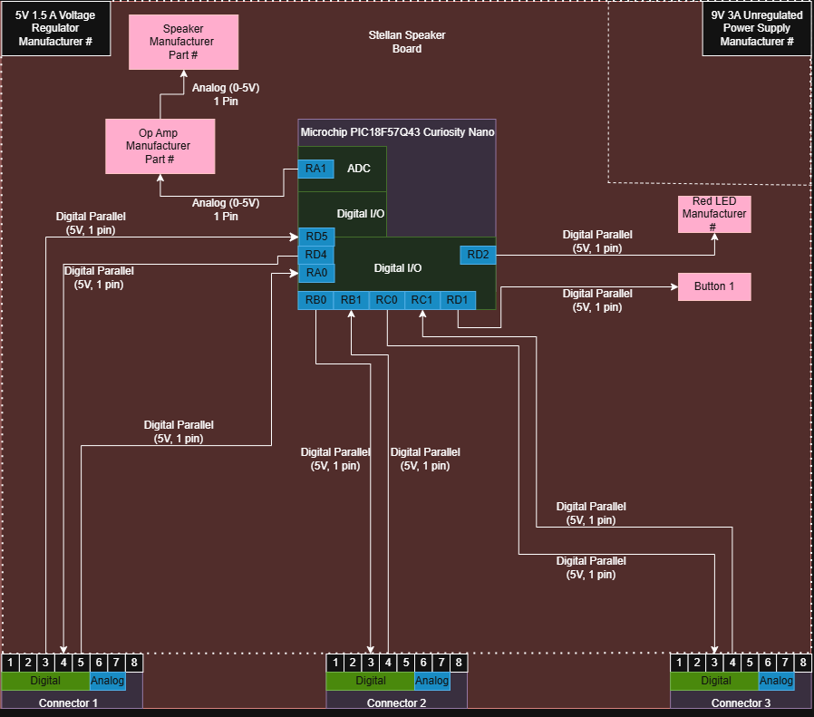

## Overview
This block diagram goes over how the central hub of the EGR 304 Team 203 combined PCB will operate. The circuit will only require 5V power, as shown by the 5V Voltage Regulator. The primary function will be receiving data and issuing commands to the various peripherals attached via the connectors. Each connector will have pin 3 be outgoing, and pin 4 be inbound, which are wired to various digital pins on the microcontroller. Pin 8 will be reserved for a common ground. Additionally, the circuit will include a on-board speaker, which will be connected to an Op-Amp, which then will be connected to the microcontroller by an analog pin. For testing purposes, a simple button and LED will also be included.

##  Block Diagram 
Stellan Smith-Rel Individual Block Diagram

